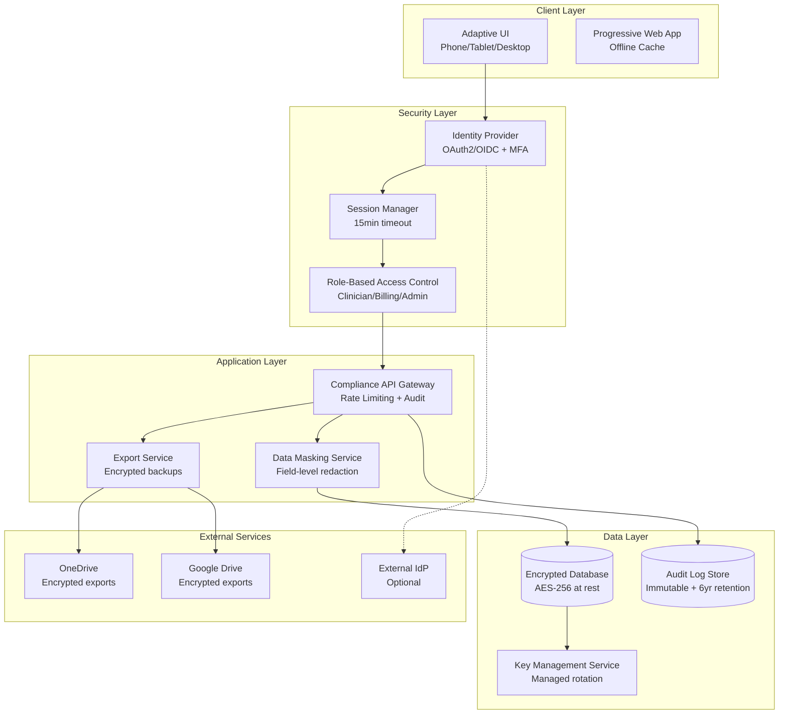

# Design Document

## Overview

This design document outlines the architecture for adding HIPAA-aware and SOX-inspired compliance features to the existing Clinical Rounding Application. The design prioritizes minimal infrastructure footprint while providing configurable compliance modes that can be upgraded from relaxed to strict HIPAA/SOX compliance as needed.

The current application is a single-page HTML application using Firebase for data storage and real-time synchronization. The compliance enhancement will transform this into a secure, auditable, and privacy-focused healthcare application while maintaining its simplicity and mobile-first design.

## Architecture

### High-Level Architecture



### Technology Stack Selection

**Current Stack Analysis:**
- Frontend: Single HTML file with vanilla JavaScript
- Database: Firebase Firestore (real-time sync)
- Authentication: Firebase Auth (anonymous/custom tokens)
- Hosting: Static file hosting

**Compliance Challenges with Current Stack:**
- Firebase does not provide BAA for all services (only Firestore in GCP)
- Limited audit logging capabilities
- No built-in data masking or field-level encryption
- Anonymous authentication insufficient for compliance

**Recommended Migration Path:**

1. **Phase 1 - Minimal Compliance (Current + Enhancements)**
   - Keep existing Firebase Firestore (GCP BAA available)
   - Add compliance middleware layer
   - Implement client-side encryption for sensitive fields
   - Add audit logging service

2. **Phase 2 - Full Compliance (Optional upgrade)**
   - Migrate to AWS/Azure with full BAA coverage
   - Implement server-side rendering for better security
   - Add advanced monitoring and anomaly detection

## Components and Interfaces

### 1. Compliance Configuration Manager

**Purpose:** Manages compliance mode settings and feature toggles

**Interface:**
```typescript
interface ComplianceConfig {
  mode: 'relaxed' | 'hipaa_strict' | 'sox_strict';
  features: {
    mfaRequired: boolean;
    auditVerbosity: 'minimal' | 'detailed';
    dataRetentionYears: number;
    externalDriveExports: boolean;
    baaRequired: boolean;
  };
}

class ComplianceManager {
  getConfig(): ComplianceConfig;
  updateMode(mode: string): void;
  validateCompliance(): ComplianceStatus;
}
```

### 2. Identity and Session Management

**Purpose:** Handles authentication, MFA, and session lifecycle

**Interface:**
```typescript
interface User {
  id: string;
  roles: ('clinician' | 'billing' | 'admin')[];
  permissions: string[];
  mfaEnabled: boolean;
  lastActivity: Date;
}

class SessionManager {
  authenticate(credentials: AuthCredentials): Promise<User>;
  validateSession(token: string): Promise<User>;
  refreshSession(token: string): Promise<string>;
  logout(token: string): Promise<void>;
  enforceTimeout(): void;
}
```

### 3. Data Masking and Privacy Service

**Purpose:** Implements field-level masking and minimum necessary access

**Interface:**
```typescript
interface MaskingRule {
  field: string;
  maskType: 'redact' | 'partial' | 'hash';
  roles: string[];
  revealRequiresPermission: boolean;
}

class DataMaskingService {
  maskPatientData(data: PatientRecord, userRole: string): PatientRecord;
  revealField(fieldName: string, patientId: string, userId: string): Promise<string>;
  logFieldReveal(fieldName: string, patientId: string, userId: string): void;
}
```

### 4. Audit Logging Service

**Purpose:** Captures all compliance-relevant events with configurable verbosity

**Interface:**
```typescript
interface AuditEvent {
  timestamp: Date;
  userId: string;
  action: string;
  resourceType: string;
  resourceId: string;
  ipAddress: string;
  userAgent: string;
  result: 'success' | 'failure';
  details?: Record<string, any>;
}

class AuditLogger {
  logAccess(event: AuditEvent): void;
  logDataChange(before: any, after: any, context: AuditEvent): void;
  logExport(exportType: string, recordCount: number, context: AuditEvent): void;
  queryLogs(filters: LogFilter): Promise<AuditEvent[]>;
}
```

### 5. External Drive Export Service

**Purpose:** Handles encrypted exports to OneDrive and Google Drive

**Interface:**
```typescript
interface ExportConfig {
  provider: 'onedrive' | 'googledrive';
  accountType: 'personal' | 'enterprise';
  encryptionKey: string;
  includePHI: boolean;
  redactionLevel: 'minimal' | 'aggressive';
}

class ExternalExportService {
  validateProvider(config: ExportConfig): Promise<boolean>;
  encryptData(data: any, key: string): Promise<Buffer>;
  uploadToProvider(encryptedData: Buffer, config: ExportConfig): Promise<string>;
  downloadFromProvider(fileId: string, config: ExportConfig): Promise<Buffer>;
  decryptData(encryptedData: Buffer, key: string): Promise<any>;
}
```

## Data Models

### Enhanced Patient Record Model

```typescript
interface PatientRecord {
  // Core identifiers
  id: string;
  tokenizedId: string; // For audit logs
  
  // Basic information (maskable)
  room: string;
  name: EncryptedField<string>;
  dob: EncryptedField<string>;
  mrn: EncryptedField<string>;
  
  // Clinical data
  date: string;
  findingsCodes: string[];
  findingsValues: Record<string, any>;
  findingsText: EncryptedField<string>;
  plan: string;
  supervisingMd: string;
  
  // Workflow data
  pending: string;
  followUp: string;
  priority: boolean;
  procedureStatus: 'To-Do' | 'In-Progress' | 'Completed' | 'Post-Op';
  
  // Financial data (SOX controls)
  cptPrimary: EncryptedField<string>;
  icdPrimary: EncryptedField<string>;
  chargeCodesSecondary: EncryptedField<string>;
  
  // Compliance metadata
  archived: boolean;
  retentionDate: Date;
  lastUpdated: Date;
  lastAccessedBy: string;
  lastAccessedAt: Date;
  
  // Audit trail
  createdBy: string;
  createdAt: Date;
  modifiedBy: string[];
  version: number;
}

interface EncryptedField<T> {
  encrypted: string;
  keyId: string;
  algorithm: 'AES-256-GCM';
}
```

### Audit Log Model

```typescript
interface AuditLogEntry {
  id: string;
  timestamp: Date;
  
  // User context
  userId: string;
  userRole: string;
  sessionId: string;
  ipAddress: string;
  userAgent: string;
  
  // Action details
  action: 'view' | 'create' | 'update' | 'delete' | 'export' | 'login' | 'logout';
  resourceType: 'patient' | 'schedule' | 'settings' | 'user';
  resourceId: string; // Tokenized for patients
  
  // Change tracking (for updates)
  fieldChanges?: {
    field: string;
    oldValue?: string; // Hashed for sensitive fields
    newValue?: string; // Hashed for sensitive fields
  }[];
  
  // Result and context
  result: 'success' | 'failure' | 'denied';
  errorCode?: string;
  complianceMode: string;
  
  // Immutability
  signature: string; // HMAC for tamper detection
  retained: boolean;
  retentionDate: Date;
}
```

### Compliance Configuration Model

```typescript
interface ComplianceSettings {
  // Mode configuration
  mode: 'relaxed' | 'hipaa_strict' | 'sox_strict';
  lastModeChange: Date;
  changedBy: string;
  
  // Authentication settings
  mfaRequired: boolean;
  sessionTimeoutMinutes: number;
  passwordPolicy: {
    minLength: number;
    requireComplexity: boolean;
    maxAge: number;
  };
  
  // Data protection
  encryptionAtRest: boolean;
  fieldLevelEncryption: string[]; // List of fields to encrypt
  keyRotationDays: number;
  
  // Audit settings
  auditVerbosity: 'minimal' | 'detailed';
  retentionYears: number;
  immutableLogs: boolean;
  
  // Export controls
  externalDriveExports: boolean;
  allowPersonalAccounts: boolean;
  domainAllowlist: string[];
  
  // Third-party controls
  baaRequired: boolean;
  vendorInventory: {
    name: string;
    baaStatus: 'active' | 'expired' | 'not_required';
    dataTypes: string[];
    lastReview: Date;
  }[];
}
```

Now I need to use the prework tool to analyze the acceptance criteria before writing the correctness properties:

<function_calls>
<invoke name="prework">
<parameter name="featureName">healthcare-compliance

## Correctness Properties

*A property is a characteristic or behavior that should hold true across all valid executions of a system—essentially, a formal statement about what the system should do. Properties serve as the bridge between human-readable specifications and machine-verifiable correctness guarantees.*

### Property 1: MFA Enforcement for Financial Operations
*For any* financial data access or export operation, when MFA is enabled in the system configuration, the operation should require successful MFA verification before proceeding
**Validates: Requirements 1.2**

### Property 2: Session Timeout Consistency
*For any* user session, when the configured inactivity timeout period elapses, the session should be automatically terminated and require re-authentication
**Validates: Requirements 1.3**

### Property 3: Role-Based Access Control
*For any* user action on any resource, the system should only allow the action if the user's role includes the necessary permissions for that specific action
**Validates: Requirements 1.4**

### Property 4: Unauthorized Access Denial and Logging
*For any* unauthorized access attempt, the system should deny access and create an audit log entry containing user, timestamp, IP/device, attempted action, and resource type
**Validates: Requirements 1.5**

### Property 5: Data Encryption at Rest
*For any* sensitive data stored in the system, the data should be encrypted using AES-256 encryption before being written to persistent storage
**Validates: Requirements 2.1**

### Property 6: TLS Communication Security
*For any* data transmission between system components or to external services, the communication should use TLS 1.3 or higher encryption
**Validates: Requirements 2.2**

### Property 7: Key Management Security
*For any* encryption key used by the system, the key should be managed through a KMS/HSM service and never stored in plain text within application code or configuration files
**Validates: Requirements 2.3**

### Property 8: Comprehensive Audit Logging
*For any* system event (access, modification, authentication, financial change, or error), an audit log entry should be created containing all required fields for that event type with appropriate verbosity level
**Validates: Requirements 3.1, 3.2, 3.3, 3.4**

### Property 9: Audit Log Immutability and Retention
*For any* audit log entry created, the entry should be stored in an immutable format and retained for the configured retention period (minimum 6 years)
**Validates: Requirements 3.5**

### Property 10: Data Retention Metadata
*For any* record created in the system, the record should include retention metadata appropriate for its data category (clinical, billing, audit)
**Validates: Requirements 4.1**

### Property 11: External Export Security
*For any* export operation to external drives (OneDrive/Google Drive), the exported data should be encrypted client-side using AES-256, have PHI redacted by default, and avoid PHI in filenames
**Validates: Requirements 4.5**

### Property 12: Export Policy Enforcement
*For any* external drive export attempt, if the target account is personal and BAA policy requires enterprise accounts, the system should block the export and log the violation
**Validates: Requirements 4.4**

### Property 13: Anomaly Detection Rules
*For any* user activity pattern that matches defined anomaly criteria (excessive access, off-hours activity, repeated exports, failed logins), the system should detect and flag the anomaly
**Validates: Requirements 5.1**

### Property 14: Incident Alert Generation
*For any* detected anomaly or security incident, the system should generate an alert containing severity level, context information, and correlation IDs
**Validates: Requirements 5.2**

### Property 15: Data Minimization Enforcement
*For any* data collection or display operation, the system should only collect or show the minimum necessary fields required for the user's role and current context
**Validates: Requirements 6.1, 6.2**

### Property 16: Field Masking and Reveal Logging
*For any* sensitive field display, the field should be masked by default, and any reveal operation should require appropriate permissions and be logged
**Validates: Requirements 6.3**

### Property 17: BAA Requirement in Strict Mode
*For any* PHI handling operation when regulatory mode is set to hipaa_strict, the system should verify that active BAAs exist for all involved services before proceeding
**Validates: Requirements 7.1**

### Property 18: Vendor Access Control and Logging
*For any* vendor access to system data, the access should be limited to least-privilege permissions and logged with vendor identity, data accessed, and timestamp
**Validates: Requirements 7.3**

### Property 19: Financial Dual Approval
*For any* financial change above configured thresholds, the system should require approval from two different users with appropriate roles before committing the change
**Validates: Requirements 8.1**

### Property 20: Financial Change Versioning
*For any* billing mapping or financial code change, the system should create an immutable, versioned audit record with effective dates and change details
**Validates: Requirements 8.2**

### Property 21: Segregation of Duties Enforcement
*For any* user attempting to perform conflicting duties (clinical documentation + billing approval), the system should prevent the action and log the attempt
**Validates: Requirements 8.3**

### Property 22: Breach Case Management
*For any* confirmed security breach, the system should create a case record with timeline tracking, affected scope documentation, and evidence preservation
**Validates: Requirements 9.1**

### Property 23: Responsive UI Adaptation
*For any* screen size or orientation change, the UI should adapt using appropriate breakpoints (mobile/tablet/desktop) and layout patterns without clipping content
**Validates: Requirements 10.1, 10.3**

### Property 24: Input Mode Detection and Adaptation
*For any* primary input mode (touch vs mouse/keyboard), the UI should adjust hit targets, hover interactions, and focus states appropriately
**Validates: Requirements 10.2**

### Property 25: Privacy Control Functionality
*For any* privacy feature activation (quick-hide PHI, screen privacy mode, auto-lock), the feature should function correctly and align with session timeout settings
**Validates: Requirements 10.6**

## Error Handling

### Compliance Mode Validation
- **Graceful Degradation**: When strict compliance features are unavailable, the system should fall back to relaxed mode with appropriate warnings
- **Configuration Validation**: All compliance settings should be validated on startup and configuration changes
- **Service Dependency Handling**: External service failures (IdP, KMS, audit storage) should not prevent core clinical functionality

### Data Protection Errors
- **Encryption Failures**: Failed encryption operations should prevent data storage and generate alerts
- **Key Rotation Issues**: Key rotation failures should trigger emergency procedures while maintaining service availability
- **Audit Log Failures**: Audit logging failures should trigger immediate alerts and potentially block sensitive operations

### Authentication and Authorization Errors
- **IdP Unavailability**: System should support cached authentication with limited functionality
- **Session Timeout Edge Cases**: Handle network interruptions and browser state inconsistencies
- **Role Assignment Conflicts**: Prevent and resolve conflicting role assignments

## Testing Strategy

### Dual Testing Approach
The testing strategy employs both unit tests and property-based tests as complementary approaches:

- **Unit tests**: Verify specific examples, edge cases, and error conditions
- **Property tests**: Verify universal properties across all inputs
- Both are necessary for comprehensive coverage

### Unit Testing Focus
Unit tests should concentrate on:
- Specific compliance configuration examples
- Integration points between components (IdP, KMS, audit storage)
- Edge cases in session management and timeout handling
- Error conditions and fallback behaviors

### Property-Based Testing Configuration
- **Minimum 100 iterations** per property test due to randomization
- Each property test must reference its design document property
- **Tag format**: **Feature: healthcare-compliance, Property {number}: {property_text}**

### Property Test Examples

**Property 3: Role-Based Access Control**
- Generate random users with various role combinations
- Generate random resource access attempts
- Verify that access is granted only when user roles include necessary permissions
- **Feature: healthcare-compliance, Property 3: Role-Based Access Control**

**Property 8: Comprehensive Audit Logging**
- Generate random system events of different types
- Verify that each event produces an audit log with all required fields
- Verify that verbosity levels are applied correctly based on event type
- **Feature: healthcare-compliance, Property 8: Comprehensive Audit Logging**

**Property 11: External Export Security**
- Generate random export requests with various data types
- Verify that all exports are encrypted, PHI is redacted, and filenames are safe
- Test with different export destinations and configurations
- **Feature: healthcare-compliance, Property 11: External Export Security**

### Testing Infrastructure Requirements
- **Mock Services**: IdP, KMS, external drive APIs for isolated testing
- **Test Data Generation**: HIPAA-compliant synthetic patient data
- **Compliance Validation**: Automated checks for regulatory requirement coverage
- **Performance Testing**: Ensure compliance features don't degrade clinical workflow performance